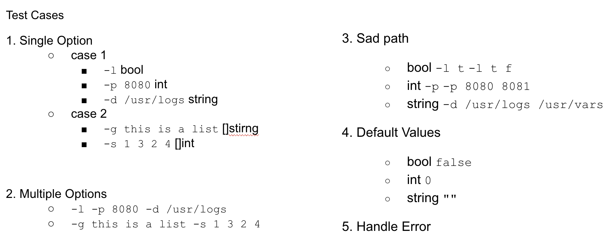

# Test Driven Development
## Introduction
Developed a command-line argument parser using Java and JUnit following the Test-Driven Development (TDD) approach. Ensured functionality and maintainability through test-first design, enabling robust support for various parameter formats and error-handling scenarios.

## Specification
1. Parse general parameter types, such as -l representing a boolean, -p representing an integer, and -d representing a string.
2. Parse array-type parameters, such as -g representing a string array and -s representing an integer array.
3. Handle sad path scenarios where a flag is followed by a parameter of an unexpected type.
4. Define default values for each flag.
5. Implement error handling.

* Mastered TDD concepts and techniques from this column and conducted a technical sharing session within the company.
  * Couse Link: [TDD](https://time.geekbang.org/column/intro/100109401)
  * Technical Sharing Presentation Slides: [TDD Sharing](https://docs.google.com/presentation/d/1_smkX5qbo1wwg1eTw75Vydz-kQfGb5Gd/edit?usp=sharing&ouid=103824221418435923614&rtpof=true&sd=true)